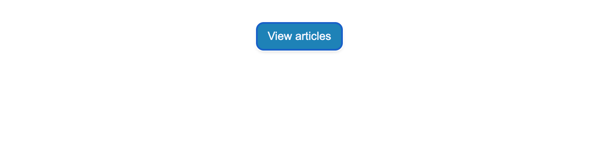
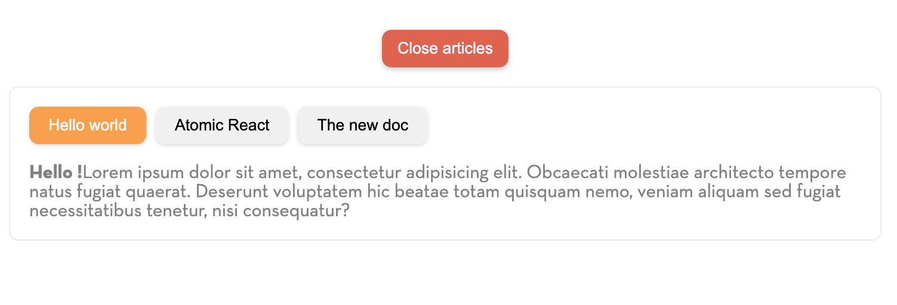
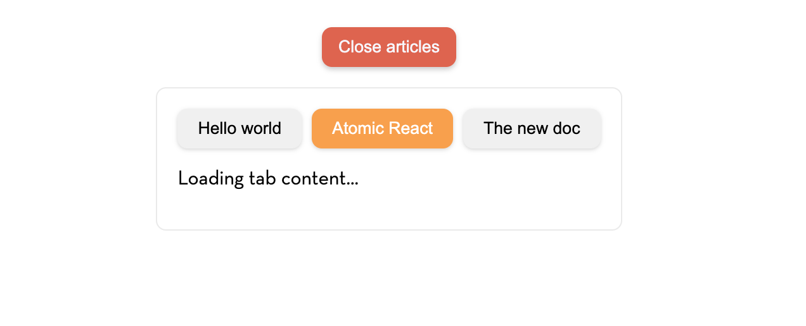
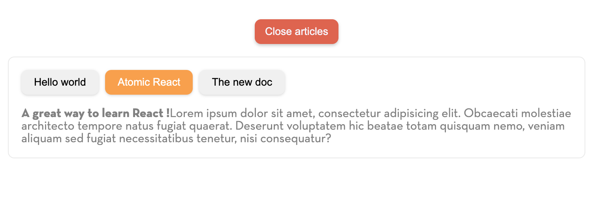
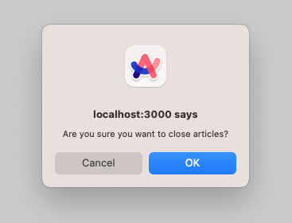

# ⚛️ Atomic React - React Components Exercise "Tabs"

## ⬇️ Install and run the project

To start the exercise, clone the repository:

```bash
git clone git@github.com:Atomic-React/react-components-ex-tabs.git
```

Go to the project folder

```bash
cd react-components-ex01
```

Install dependencies:

```bash
npm install
```

Run the project:

```bash
npm start
```

## 📝 The exercise

The aim of this exercise is to practice the following concepts:

* State
* State updates
* Props
* Events
* Components life cycle

After cloning the repository, installing dependencies and running the project, go to `http://localhost:3000` in your browser. You will find the following screen:



Explore the code of the project before starting the exercise.

### Part 1

The expected behavior is that when you click on the `View articles` button, the tabs with the articles should appear as below:



Don't worry about the `Close articles` button, you will deal with it later.

For now, just take care about displaying the tabs block with dummy data.

### Part 2

Now, it is time to retrieve real data.

Find the `articles.service.jsx` file in the `services/` folder, itself inside the `app/` folder.

You can use the `getArticles` method to display the tab buttons titles.

<details>
 <summary>💡 Hint</summary>
 <p>
  The `getArticles` method returns the `id` of each article. Use it to trigger a `click` handler that will be used to get the article according to the `id` of the article's button the user clicked on.
 </p>
</details>

When the user open the articles, the first tab should be selected by default and the content of this tab should be displayed as well.  You can use the `getArticleById` method in the `articles.service.jsx` to do it.

It is time to use life cycle methods!

> Be careful! The `getArticlesById` method returns a `Promise`.

<details>
 <summary>💡 Hint</summary>
 <p>
  Use the `componentDidMount` method in the tabs component to retrieve an article by its id.
 </p>
</details>

Then, each tab button click should change the text content according to the corresponding article.

**IMPORTANT**: Don't call the `getArticleById` method inside the click handler of the buttons. For this exercise, we want to use the components life cycle methods. So you should only call the `getArticleById` method when the active tab state is updated.

Remind that the `getArticlesById` method returns a Promise. It does not returns the wanted article instantly. So we need to add a loading state:



Once the article data are received, we want to display the content:



### Part 3

When you click on the `Close articles` button, the React application should hide the tabs block.

But, we want to warn the user before the articles block effectively hides:



**IMPORTANT**: Use the life cycle methods to detect if the tabs component is about to be unmounted to display the alert.

<details>
 <summary>💡 Hint</summary>
 <p>
  The method you are looking for is `componentWillUnmount`.
 </p>
</details>

If the user click on the `cancel` button, the articles should remain displayed. On the other hand, if the user click on the `ok` button, the articles should hide.

### Part 4

You are done ! 🎉

Find the full correction of the exercise here: <https://github.com/Atomic-React/react-components-ex-tabs/tree/correction>
